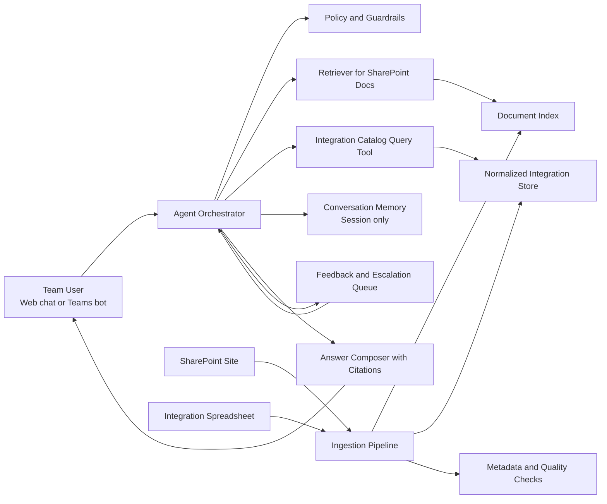

# AA Workday Team Agent Architecture

## Objective

Build an internal assistant that helps the AA Workday team answer questions faster, locate documentation, understand existing integrations, and reduce dependency on tribal knowledge.

The first version should answer questions such as:

- What integrations exist between Workday and downstream systems?
- Which team or owner supports a specific integration?
- Where is the runbook or design note for a process?
- What changed in a documented process or interface?
- What should an analyst check before escalating an issue?

## Recommended Product Scope

Start with a read-only assistant.

The initial agent should:

- Search and summarize SharePoint documentation
- Search and explain the integration inventory spreadsheet
- Return citations to the underlying documents or rows
- Compare multiple sources and call out inconsistencies
- Capture unanswered questions for human follow-up

The initial agent should not:

- Update Workday
- Trigger production integrations
- Modify SharePoint content automatically
- Invent answers when source data is missing

## Core Design Principle

Treat the two data sources differently:

- SharePoint content is unstructured knowledge and should use retrieval over indexed document chunks
- The integrations spreadsheet is structured operational data and should be normalized into queryable records

This avoids forcing spreadsheet facts through a pure vector-search workflow, which usually produces weaker answers for inventory-style questions.

## Target Architecture

## Logical Components

### 1. User Channels

Expose the assistant where the team already works.

Preferred channels:

- Microsoft Teams chat bot for daily operational use
- Optional web interface for richer investigation and admin views

### 2. Agent Orchestrator

The orchestrator is responsible for:

- Interpreting the user request
- Choosing whether to retrieve documents, query the integration catalog, or do both
- Asking clarifying questions when the request is ambiguous
- Enforcing response rules such as citations and confidence thresholds

The orchestration pattern should be tool-based, not a single monolithic prompt.

### 3. SharePoint Knowledge Retrieval

The SharePoint site should be ingested into a document pipeline that:

- Pulls pages, documents, titles, URLs, authors, timestamps, and folder metadata
- Cleans up navigation noise, repeated headers, and boilerplate
- Chunks content for retrieval
- Stores embeddings plus metadata for hybrid retrieval

Recommended metadata fields:

- Source URL
- Document title
- Page type
- Last modified date
- Functional area
- Integration names mentioned
- Owner or team if available

### 4. Integration Catalog Service

The spreadsheet should not remain only as a file attachment for retrieval.

Instead, build a small normalization pipeline that converts each row into a structured record such as:

- Integration name
- Source system
- Target system
- Direction
- Protocol or transport
- Frequency
- Owner team
- Support contact
- Environment coverage
- Criticality
- Last updated date
- Spreadsheet row identifier

This store should back a query tool that the agent can call for precise questions like:

- List all payroll-related integrations
- Which integrations are owned by a specific team?
- What downstream systems receive worker updates?

### 5. Answer Composer

Responses should combine:

- Natural language summary
- Structured results when relevant
- Citations back to SharePoint URLs and spreadsheet row identifiers
- Explicit uncertainty when sources conflict or data is stale

### 6. Feedback and Escalation

Add a lightweight feedback loop from the start.

Capture:

- Unanswered questions
- Low-confidence responses
- User thumbs up or down
- Requests to correct outdated documentation

This becomes the backlog for improving source quality and retrieval quality.

## Query Handling Pattern

### Document-heavy questions

Examples:

- How does the recruiting onboarding workflow work?
- Where is the runbook for worker data issues?

Pattern:

1. Retrieve relevant SharePoint content
2. Re-rank by metadata and semantic relevance
3. Summarize with citations

### Structured inventory questions

Examples:

- What integrations feed payroll?
- Which integrations are file-based?

Pattern:

1. Query the normalized integration catalog
2. Return tabular or bullet results
3. Optionally enrich with supporting documentation

### Mixed questions

Examples:

- Tell me about the benefits vendor integration and link the support docs

Pattern:

1. Resolve the integration entity from the catalog
2. Retrieve related SharePoint documents using integration metadata
3. Compose one response with structured facts and document citations

## Ingestion Architecture

### SharePoint Pipeline

Pipeline stages:

1. Scheduled extraction from SharePoint
2. Content cleaning and chunking
3. Metadata enrichment
4. Embedding and indexing
5. Freshness tracking and failed-document reporting

### Spreadsheet Pipeline

Pipeline stages:

1. Load latest spreadsheet version
2. Validate required columns
3. Normalize values and map synonyms
4. Publish records to the integration catalog store
5. Flag missing owners, stale rows, and malformed records

This ingestion flow should run on a schedule and also support manual reprocessing.

## Security and Governance

This is important because Workday-related content may include sensitive operational or HR-adjacent information.

Minimum controls:

- Enterprise authentication only
- Role-based access aligned to the AA team and approved stakeholders
- Source-level authorization where feasible
- No training on user conversations by default
- Logged citations for every answer
- Redaction rules for sensitive fields if they appear in source data
- Clear separation between read-only agent capabilities and any future action-taking features

## Non-Functional Requirements

Target characteristics for phase one:

- Response latency under 10 seconds for typical questions
- Strong citation discipline for every factual answer
- Traceability from answer to source document or spreadsheet row
- Daily or near-real-time ingestion refresh depending on source volatility
- Operational dashboard for ingestion failures and low-confidence questions

## Recommended MVP

Build the MVP around four services:

1. Chat experience
2. Agent orchestrator
3. SharePoint retrieval index
4. Integration catalog API

MVP outcomes:

- Users can ask questions in plain language
- The agent can answer from both sources
- Every answer includes citations
- The team can identify content gaps and stale ownership data

## Suggested Delivery Phases

### Phase 1: Knowledge Assistant

- Ingest SharePoint and spreadsheet data
- Deliver read-only Q and A
- Add citations and feedback capture

### Phase 2: Operational Intelligence

- Add filters for owner, environment, vendor, and integration type
- Add stale-data detection and contradiction detection
- Add dashboards for common support themes

### Phase 3: Guided Operations

- Add approved playbooks for incident triage
- Draft responses for analysts to review
- Potentially integrate with ticketing systems for escalation support

## Key Risks

- SharePoint content quality may be inconsistent or outdated
- Spreadsheet columns may be incomplete or manually maintained with inconsistent naming
- Users may expect authoritative answers even when the sources disagree
- Sensitive operational details may need stronger access controls than a generic team bot

## Assumptions

- The SharePoint site is accessible through supported enterprise APIs or export mechanisms
- The spreadsheet has stable identifiers or can be normalized into them
- The first release is intended for internal staff, not general employees
- The first release is advisory only and does not make Workday changes

## Recommended Next Artifacts

After approving this architecture, the next documents to create are:

- Source data contract for the integration spreadsheet
- Retrieval evaluation plan with sample questions from the AA team
- Access control matrix
- MVP backlog and implementation plan